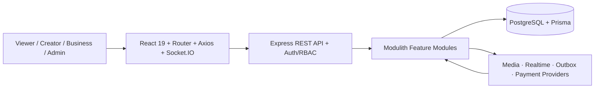
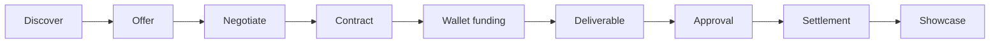

# VYRA — Influence Hub төслийн танилцуулга

> Дипломын PPT-д шууд ашиглах slide plan, дэлгэц дээр харагдах текст, ярих тайлбар, demo storyboard.
>
> Шинжилсэн огноо: 2026-08-10

## Танилцуулгын үндсэн тохиргоо

- Нийт хугацаа: **10 минут**
- Слайдын тоо: **14**
- Demo бичлэг: **80–90 секунд**
- Үндсэн бүтэц: **Асуудал → Шийдэл → Нотолгоо**
- Нэг слайд: **нэг санаа, нэг гол зураг эсвэл нэг том тоо**
- Бүтээгдэхүүний нэр: **VYRA**
- Төслийн тайлбар нэр: **Influence Hub**
- Ангилал: **Influencer marketplace + collaboration workspace + social showcase platform**

### 15 секундийн гол мессеж

> **VYRA нь Business ба Creator-ийг хайлтаас эхлээд санал, гэрээ, ажлын хүргэлт, төлбөр, нийтлэл хүртэл нэг баталгаатай workflow-д холбодог платформ.**

### Слайдын дизайн

- Background: `#0d0d0d`
- Primary accent: VYRA pink `#ff76bd`
- Secondary accent: mint `#bbf7d0`
- Main text: white
- Secondary text: 45–60% opacity white
- VYRA-ийн одоогийн typography, logo, border radius, dark theme-ийг хадгална.
- Slide title 32–44 pt, гол тоо 64–96 pt, тайлбар 20–26 pt байна.
- Нэг слайд дээр 25–30-аас олон үг бүү байрлуул.
- Screenshot бүрийн шаардлагагүй sidebar, browser toolbar, personal мэдээллийг crop хийнэ.

---

## 1. Нээлт

### Slide 1 — Нэг campaign. Олон салангид хэрэгсэл.

**Хугацаа:** 30 секунд

**Слайд дээр зөвхөн:**

> **Нэг influencer campaign хийхийн тулд хэдэн app солих хэрэгтэй вэ?**

Доор нь жижиг icon-оор:

`Social DM → Spreadsheet → Email → Contract → Bank → Drive → Social post`

**Visual:**

- Дээрх долоон хэрэгслийг тасархай шугамаар холбоно.
- Шугамын голд улаан/pink өнгөөр `LOST CONTEXT` гэж нэг удаа харуулна.
- Logo болон өөрийн нэрийг энэ слайдын гол хэсэгт бүү тавь.

**Ярих текст:**

> “Нэг influencer campaign эхлүүлэхэд creator-оо social media-аас хайна. Саналаа DM-ээр, нөхцөлөө spreadsheet-ээр, гэрээгээ email-ээр, төлбөрөө банкаар, файлаа drive-аар солилцдог. Эдгээрийн аль нэгэнд мэдээлэл алдагдахад хэн юу зөвшөөрсөн, ажил хүргэгдсэн эсэх, төлбөр хаана байгааг нотлоход хэцүү болдог.”

**Дараагийн слайд руу шилжих өгүүлбэр:**

> “Энэ нь зөвхөн нэг талын биш, оролцогч бүрийн асуудал юм.”

---

## 2. Асуудал

### Slide 2 — Дөрвөн тал, нэг тасарсан процесс

**Хугацаа:** 35 секунд

**Слайд дээр:**

| Business | Creator | Viewer | Admin |
|---|---|---|---|
| Зөв хүнээ олох | Найдвартай санал авах | Бодит ажлыг олох | Эрсдэлийг хянах |

**Visual:**

- Дөрвөн дүртэй, center-д нь тасарсан workflow байрлуулна.
- Дэлгэрэнгүй bullet бүү нэм.

**Ярих текст:**

> “Business-д тохирох creator болон бодит statistics-ийг ялгах хэцүү. Creator-д санал, нөхцөл, файл, төлбөр нь олон сувгаар тардаг. Viewer-д creator-ийн бодит ажил, brand collaboration-ийг нэг feed-ээс харах боломж бага. Admin-д мөнгө, эрх, баталгаажуулалт, audit-ийг нэг дор хянах шаардлага үүсдэг.”

### Slide 3 — Асуудал нь “creator хайх” дээр дуусдаггүй

**Хугацаа:** 30 секунд

**Слайд дээр:**

> **DISCOVERY ≠ COMPLETED WORK**

Доор нэг урсгал:

`Find → Agree → Contract → Fund → Deliver → Approve → Publish`

**Visual:**

- `Find`-ээс `Publish` хүртэлх урсгалын дунд 3 тасархай хэсгийг pink өнгөөр тэмдэглэнэ.

**Ярих текст:**

> “Marketplace зөвхөн creator олж өгөөд зогсвол бодит ажлын хамгийн эрсдэлтэй хэсгүүд болох нөхцөл тохирох, гэрээ батлах, мөнгө хамгаалах, deliverable хүлээн авах, үр дүнгээ нийтлэх асуудлыг шийдэхгүй. Миний төслийн хүрээ бүтэн lifecycle-ийг хамарсан.”

---

## 3. Шийдэл

### Slide 4 — Нэг платформ, нэг баталгаатай workflow

**Хугацаа:** 35 секунд

**Слайд дээр:**

> **VYRA**
>
> `Marketplace + Workspace + Showcase`

**Visual:**

- Зүүн талд Business, баруун талд Creator.
- Голд нь VYRA.
- Доод талд Viewer болон Admin.

**Ярих текст:**

> “VYRA бол creator marketplace, freelancer collaboration workspace, social showcase гэсэн гурван бүтээгдэхүүнийг нэгтгэсэн систем. Хэрэглэгч нэг account-аар нэвтэрч, шаардлагатай үед Creator эсвэл Business channel үүсгэнэ. Viewer байдлаар feed үзэж, follow болон save хийж болно.”

### Slide 5 — Role бүр өөрийн ажлын орчинтой

**Хугацаа:** 40 секунд

**Слайд дээр:**

- **Business:** Find → Offer → Fund → Approve
- **Creator:** Discover → Negotiate → Deliver → Earn
- **Viewer:** Watch → Follow → Save
- **Admin:** Verify → Audit → Finance

**Visual:**

- Дөрвөн compact card.
- Card бүр нэг icon, дөрвөн үйл үгтэй байна.

**Ярих текст:**

> “Business creator хайж, shortlist болон compare хийж, work offer илгээнэ. Creator campaign discover хийж, саналд counter proposal өгч, гэрээний дараа ажлаа хүргэнэ. Viewer Showcase feed-ээс post, story, collaboration үзнэ. Admin нь platform finance, verification, reports болон audit-ийг role-based permission-оор удирдана.”

### Slide 6 — Нэг collaboration-ийн бүтэн замнал

**Хугацаа:** 45 секунд

**Слайд дээр:**

`1. Discover → 2. Offer → 3. Negotiate → 4. Contract → 5. Fund → 6. Deliver → 7. Showcase`

**Visual:**

- Долоон алхамтай horizontal timeline.
- Алхам 5–6 хооронд wallet icon.
- Алхам 7 дээр public feed icon.

**Ярих текст:**

> “Business creator эсвэл campaign дээрээс work request эхлүүлнэ. Creator accept, decline эсвэл counter proposal хийнэ. Хоёр тал зөвшөөрсний дараа workspace, version-тэй agreement болон contract үүснэ. Business wallet-аас ажил санхүүжигдэнэ. Creator deliverable оруулж, Business approve хийсний дараа settlement хийгдэж, хоёр тал зөвшөөрвөл completed work Showcase-д гарна.”

---

## 4. Демо

### Slide 7 — 90 секундэд нэг campaign-ийн бүтэн lifecycle

**Хугацаа:** 90 секунд

**Слайд дээр:**

> **Business offer → Creator delivery → Wallet settlement → Public Showcase**

**Visual:**

- 80–90 секундийн урьдчилан бичсэн demo video.
- Video-ийн доод буланд тухайн үеийн role-ийг `BUSINESS` / `CREATOR` гэж харуулна.

**Demo storyboard:**

| Хугацаа | Дэлгэц | Харуулах үйлдэл | Ярих тайлбар |
|---:|---|---|---|
| 0–8 сек | Login / channel switch | Business channel руу орно | “Нэг account-аас Business болон Creator channel-аа сольж болно.” |
| 8–20 сек | Business → Creators | Search/filter хийж profile нээнэ | “Business бодит бүртгэлтэй creator-уудыг хайж, тохирох хүнийг сонгоно.” |
| 20–32 сек | Work offer | Campaign, budget, deadline оруулж санал илгээнэ | “Санал системд хадгалагдаж Creator-д notification очно.” |
| 32–43 сек | Creator → Work requests | Counter эсвэл accept хийнэ | “Creator нөхцөлийг зөвшөөрөх эсвэл шинэ санал гаргах боломжтой.” |
| 43–55 сек | Collaboration workspace | Agreement, task, contract харуулна | “Зөвшөөрөгдсөн санал нэг shared workspace болдог.” |
| 55–66 сек | Business wallet | Collaboration-ийг fund хийнэ | “Provider баталгаажсан мөнгө л wallet-д орж, collaboration-д түгжигдэнэ.” |
| 66–76 сек | Deliverables | Creator файл оруулж, Business approve хийнэ | “Approval нь settlement-ийн business event болдог.” |
| 76–84 сек | Wallet / Finance | Creator earning, platform fee харуулна | “Default тохиргоогоор 90% Creator, 10% platform revenue болно.” |
| 84–90 сек | Showcase | Дууссан ажлыг public feed дээр харуулна | “Ажлын үр дүн дараагийн хэрэглэгчдэд нотолгоо болж үлдэнэ.” |

**Demo бичлэгийн заавар:**

1. 1920×1080 resolution ашиглана.
2. Browser zoom-ийг 90% эсвэл 100% дээр тогтмол байлгана.
3. Cursor-оо огцом хөдөлгөхгүй.
4. Нууц үг, OTP, API key, бодит дансны мэдээлэл харуулахгүй.
5. Demo account, campaign, offer, deliverable-ээ бичлэгээс өмнө бэлэн болгоно.
6. Video-г PPT файлдаа embed хийж, тусдаа `.mp4` backup авч явна.
7. Video ажиллахгүй үед ашиглах 6 screenshot-ийг мөн бэлдэнэ.

**Заавал авах backup screenshot:**

- Business creator discovery
- Work offer form
- Creator work request
- Collaboration workspace
- Wallet settlement
- Public Showcase

---

## 5. Технологи ба архитектур

### Slide 8 — Нэг хүсэлт таван ойлгомжтой блок дамжина

**Хугацаа:** 55 секунд

**Слайд дээр:**

```text
React Client
     ↓
Express API
     ↓
Feature Modules
     ↓
Prisma + PostgreSQL
     ↓
Realtime / Provider / Worker
```

**Visual:**

- Таван том блок, дөрвөн сум.
- `Feature Modules` блокийг pink хүрээтэй болгоно.
- Жижиг class/UML diagram бүү оруул.

**Ярих текст:**

> “Frontend нь React SPA бөгөөд REST API болон Socket.IO event ашиглана. Backend-ийг microservice биш modular monolith байдлаар зохион байгуулсан. Auth, marketplace, campaigns, collaboration, messaging, payments зэрэг feature бүр route, controller, service, repository, validation гэсэн boundary-тай. Prisma зөвхөн repository layer-т database-тай ажиллана. PostgreSQL transaction нь contract, wallet, ledger, settlement зэрэг хоорондоо холбоотой өөрчлөлтийг атомик хадгална.”

**Комисс асуувал — Яагаад Modular Monolith вэ?**

> “Нэг хөгжүүлэгчтэй дипломын төсөлд microservice-ийн deployment болон network complexity хэрэггүй. Харин module boundary-г хадгалснаар feature-үүд салангид хөгжих, тестлэх боломжтой бөгөөд finance transaction нэг database дотор найдвартай үлдэнэ.”

**Комисс асуувал — Яагаад PostgreSQL вэ?**

> “Campaign, contract, collaboration, payment, ledger нь хүчтэй relation болон ACID transaction шаарддаг. PostgreSQL нь relational integrity, transaction, index, audit query-д тохирсон.”

### Slide 9 — Төлбөр “тоо нэмэх” биш, баталгаатай хөдөлгөөн

**Хугацаа:** 45 секунд

**Слайд дээр:**

> **Verified top-up → Pending funds → Approval → 90% / 10%**

**Visual:**

- Business wallet → Pending → хоёр салаа:
  - Creator available: `90%`
  - Platform revenue: `10%`
- `10%` нь default configuration бөгөөд admin setting-ээр өөрчлөгдөж болохыг жижиг footnote-д бичнэ.

**Ярих текст:**

> “Frontend-ээс amount илгээсэн төдийд balance нэмэгдэхгүй. Provider callback шалгагдаж, idempotency key-аар давхардлыг хориглосны дараа top-up ledger-д бичигдэнэ. Collaboration fund хийхэд creator-ийн орлого pending байна. Deliverable approve болон release-ийн дараа creator available balance, platform revenue хоёр тусдаа ledger posting-оор баталгаажна. Refund, payout, dispute мөн ижил ledger зарчмаар явна.”

### Slide 10 — Security нь route хамгаалахаас илүү

**Хугацаа:** 40 секунд

**Слайд дээр:**

`bcrypt` · `JWT rotation` · `4 roles` · `Zod` · `Rate limit` · `Audit`

**Visual:**

- Зургаан shield/icon.
- Тайлбар өгүүлбэр бүү нэм.

**Ярих текст:**

> “Нууц үгийг bcrypt-ээр hash хийдэг. Access болон refresh JWT тусдаа бөгөөд refresh reuse илэрвэл token family-г хүчингүй болгоно. VIEWER, CREATOR, BUSINESS, ADMIN гэсэн дөрвөн role-той. Request бүр Zod validation, authentication, ownership эсвэл permission middleware дамжина. Helmet, CORS, rate limit, private media policy, request ID болон audit log ашигласан.”

---

## 6. Үр дүн ба нотолгоо

### Slide 11 — 266 automated checks, 0 failure

**Хугацаа:** 45 секунд

**Слайд дээр томоор:**

> **209 / 209** Backend tests
>
> **57 / 57** Frontend tests
>
> **0** Failure

Доор жижиг:

`ESLint PASS · Production build PASS`

**Visual:**

- Backend болон Frontend гэсэн хоёр том багана.
- `0 failure`-ийг mint өнгөөр тодруулна.

**Ярих текст:**

> “Энэ төслийн нотолгоо нь зөвхөн дэлгэцийн зураг биш. Одоогийн repository дээр 209 backend test, 57 frontend test бүгд амжилттай ажилласан. Auth, refresh reuse, ownership, search, messaging, story expiry, collaboration state, payment idempotency, wallet settlement, refund, role permission зэрэг critical урсгалуудыг шалгасан. Frontend ESLint болон production build мөн амжилттай.”

**Нэмэлт нотолгоо — асуувал хэлэх:**

- 33 backend feature module
- 116 frontend route
- 70 Prisma model
- 4 user role
- 20 backend test file
- Structured request logging болон typed error response

> 70 model-ийг үндсэн слайд дээр бүү тавь. Комисс database scope асуусан үед auth token, audit, media, social stats, content, ledger, provider event зэрэг persistence entity хамт тоологдсоныг тайлбарлана.

---

## 7. Хязгаарлалт ба сурсан зүйл

### Slide 12 — Код бэлэн ≠ Production бэлэн

**Хугацаа:** 45 секунд

**Слайд дээр:**

1. **Provider:** production credential ба live reconciliation туршаагүй
2. **Scale:** бодит хэрэглэгчийн pilot metric хараахан байхгүй
3. **Delivery:** object storage/CDN болон public SSR шаардлагатай

**Visual:**

- Гурван compact warning card.
- “Алдаа” биш “Next validation” гэсэн гарчиг хэрэглэнэ.

**Ярих текст:**

> “Миний хамгийн том хязгаарлалт бол automated test хүчтэй боловч бодит хэрэглэгчийн pilot хийгдээгүй. Stripe/QPay provider adapter болон webhook flow бий ч production credential-тай бодит мөнгөөр хамгаалалтын үеэр ажиллуулахгүй. Media-г production object storage/CDN рүү шилжүүлэх, public profile болон Showcase-д SSR нэмэх шаардлагатай. Энэ төсөл надад UI хийхээс илүү state transition, ownership, idempotency болон audit нь marketplace-ийн найдвартай байдлыг шийддэгийг сургасан.”

---

## 8. Цаашдын төлөвлөгөө

### Slide 13 — 30 / 90 / 180 хоног

**Хугацаа:** 40 секунд

**Слайд дээр:**

- **30 хоног:** staging, object storage, provider sandbox monitoring
- **90 хоног:** 5 Business + 20 Creator pilot
- **180 хоног:** verified social sync, SSR, recommendation experiment

**Visual:**

- Гурван том хугацаатай timeline.
- Хугацаа бүрд нэг icon, нэг мөр текст.

**Ярих текст:**

> “Эхний 30 хоногт deployment, cloud media storage, monitoring болон payment sandbox reconciliation-ийг production-like орчинд батална. 90 хоногт 5 business, 20 creator-той pilot хийж offer-to-contract conversion, campaign completion time, payment release time хэмжинэ. 180 хоногт social statistics verification, public SSR болон recommendation ranking experiment нэмнэ.”

---

## 9. Хаалт

### Slide 14 — Хайлтаас нотлогдсон үр дүн хүртэл

**Хугацаа:** 25 секунд

**Слайд дээр:**

> **DISCOVER → COLLABORATE → EARN → SHOWCASE**
>
> **266 automated checks · 0 failure**

Доод буланд:

`VYRA · [Өөрийн нэр] · [Email/GitHub]`

**Visual:**

- VYRA logo.
- Дөрвөн үгтэй нэг шугаман урсгал.
- “Баярлалаа” гэсэн том гарчиг бүү ашигла.

**Ярих текст:**

> “VYRA нь creator олохоос эхлээд хамтын ажлыг баталгаажуулж, орлогыг зөв хуваарилан, үр дүнг дараагийн хэрэглэгчдэд харуулах хүртэлх нэг тасралтгүй workflow юм. Одоогийн хувилбар 266 automated check-ээр баталгаажсан. Асуултад бэлэн байна.”

---

## PPT-д оруулах architecture зураг

Доорхыг Mermaid screenshot хэлбэрээр шууд бүү наа. PowerPoint дээр таван том блок болгон дахин зур.



## PPT-д оруулах lifecycle зураг



## Асуулт–хариултын бэлтгэл

### “Танай төсөл бусад social platform-аас юугаараа ялгаатай вэ?”

> “Энэ нь зөвхөн content feed биш. Content-ийн ард offer, agreement, contract, deliverable, payment, review гэсэн баталгаатай commercial workflow байдаг. Completed collaboration нь хоёр талын зөвшөөрлөөр Showcase болж харагдана.”

### “Freelance platform-аас юугаараа ялгаатай вэ?”

> “Creator discovery нь portfolio-оос гадна social presence, campaign fit, public content болон verified collaboration history ашигладаг. Дууссан ажил private workspace-д үлдэхгүй, public reputation asset болж хувирна.”

### “Payment дээр давхар мөнгө орохоос яаж хамгаалсан бэ?”

> “Verified provider event, unique provider reference, idempotency key, transaction lock болон ledger batch identity ашигласан. Ижил callback дахин ирсэн ч шинэ balance үүсгэхгүй.”

### “Яагаад 10% commission вэ?”

> “10% нь одоогийн default platform setting. Finance rule нь hardcoded UI утга биш бөгөөд admin configuration-аас авна. PAID болон HYBRID cash portion-д хувь тооцож, BARTER-д configurable fixed fee хэрэглэнэ.”

### “Creator ажлаа хийсний дараа мөнгөө яаж авдаг вэ?”

> “Business wallet-аас funding хийхэд Creator-ийн орлого pending account-д орно. Deliverable approve, шаардлагатай publish proof болон release state биелсний дараа available account руу шилжинэ. Дараа нь payout хүсэлт гаргана.”

### “Role permission хэрхэн ажилладаг вэ?”

> “Account анх VIEWER. Дараа нь Creator, Business channel үүсгэхэд role нэмэгдэнэ. Route-level authenticate, role permission, resource ownership гэсэн гурван түвшний шалгалттай.”

### “Mock data ашигласан уу?”

> “Active marketplace болон dashboard screens нь API/PostgreSQL өгөгдөл ашигладаг. Demo account үүсгэх seed script байж болох ч UI fixture-ийг production flow-д ашигладаггүй.”

### “Одоо production-д гаргаж болох уу?”

> “Core workflow болон automated tests бэлэн. Харин production payment credential, object storage, monitoring, backup/restore drill, load test, real-user pilot-ийг дуусгасны дараа production launch хийнэ.”

### “Хамгийн хэцүү шийдэл юу байсан бэ?”

> “UI биш, collaboration болон payment-ийн state transition хамгийн хэцүү байсан. Нэг action давхар дуудагдсан ч balance давхар нэмэгдэхгүй, зөвхөн participant private resource-ийг харах, dispute үед release зогсох зэрэг invariants-ийг transaction болон automated test-ээр хамгаалсан.”

## Хамгаалалтын өмнөх checklist

- [ ] `[Өөрийн нэр]`, `[Email/GitHub]` placeholder-уудыг солино.
- [ ] VYRA logo-г transparent PNG эсвэл SVG-ээр оруулна.
- [ ] 80–90 секундийн demo video бэлэн болгоно.
- [ ] Demo video-ийн 6 backup screenshot бэлдэнэ.
- [ ] Demo account-уудын password-ийг slide/video дээр харуулахгүй.
- [ ] Browser notification болон personal tab-уудыг хаана.
- [ ] PPT-г өөр компьютер дээр offline горимоор туршина.
- [ ] Font embed эсвэл стандарт fallback font ашиглана.
- [ ] Нийт яриаг 10 минутад багтааж 3 удаа rehearsal хийнэ.
- [ ] Slide 11-ийн test тоог хамгаалалтын өмнөх өдөр дахин ажиллуулж баталгаажуулна.
- [ ] Асуулт–хариултын үед Slide 14 дэлгэц дээр үлдэнэ.

## Нэг мөрөөр санах дараалал

> **Асуудал → Оролцогч → Шийдэл → Workflow → Demo → Architecture → Нотолгоо → Хязгаарлалт → Төлөвлөгөө → Гол мессеж**
